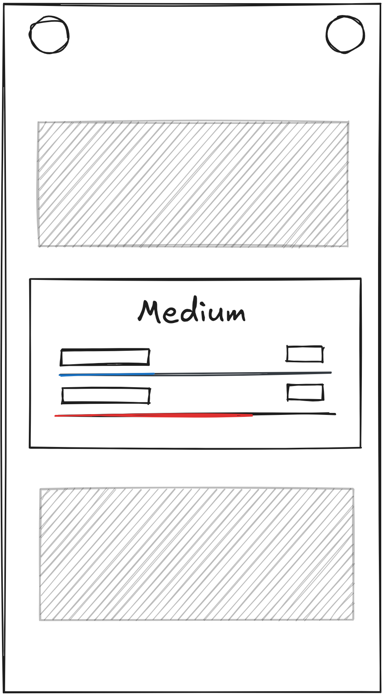
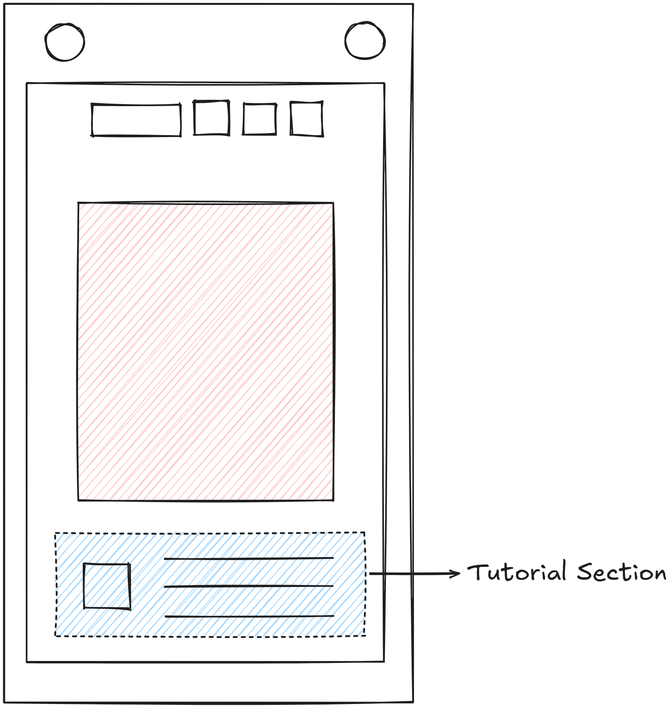

# Neutronic Responsive Design Guide

## Terminology

We categorize device screens as:
- **Desktop**: Devices with large screens, typically monitors connected to desktop computers or laptops.
- **Pad**: Tablets and similar devices with medium-sized screens, with close-to-one aspect ratios.
- **Mobile**: Smartphones and other small-screen devices, often with taller aspect ratios.

Device screens are classified based on width and aspect ratio;
- **Desktop**: Width >= 1024px
- **Pad**: 768px <= Width < 1024px and Aspect Ratio between 4:3 and 3:4
- **Mobile**: Width < 768px or Aspect Ratio outside 4:3 to 3:4

We categorize screen orientations as:
- **Landscape**: Width is greater than height.
- **Portrait**: Height is greater than width.

We also refer to:
- **Touch-Primary Screen (TPS)**: Devices that support touch input, such as tablets and smartphones.
- **Non-Touch-Primary Screen (NTPS)**: Devices that primarily use mouse and keyboard input, such as desktop computers. We consider laptops as NTPS even if they have touch screens.

We can determine if a device is a touch screen by checking for touch event support in the browser.

## Size Warnings

When the device screen width is less than 400px, issue a warning on the home page indicating that the device screen is too small for optimal experience.

## Default Orientation

On Desktop devices and pads, the default orientation is landscape. On mobile devices, the default orientation is portrait.

On mobile devices, we will issue a popup notification to suggest users to switch to the default orientation in the home view if not in it already.

## Hotkey System

On TPS devices, the hotkey system is disabled by default. Users can enable it in settings but this is considered rare usage.

## Responsive Layouts

### App Layout

On TPS devices the account button on the top is removed, and both the return button and the github button are enlarged for easier touch interaction.

### Album View

On TPS devices that adopt a horizontal layout, the swiper pagination bullets are enlarged for easier touch interaction.

On TPS devices in vertical layout, the navigation changes to a up-down scrolling model. With focus given to the central content and snap while scrolling, see image:

On TPS devices in vertical layout, the simple albums cards use multi-line in the description text to avoid text being too small when inferred from screen width.

### Sub-Album View

On TPS vertical screens, the paging system changes to a vertical scroll model, with all levels laid out in a grid that is scrollable vertically.

On TPS horizontal screens, the size of the level-box is shank down to leave margin at the bottom of the screen. In smaller screens (like 640x360) the size should ensure that all levels can be fit into the single page. Navigation is the same as on NTPS devices.

### Level View

#### Tutorial Levels

Long tutorial texts should be wrapped into multiple lines if the container cannot contain it, but prefer single-line.

#### Level Interaction

On all devices touch interaction is supported.

On TPS devices, to undo an action users double-tap on the screen on empty space. On NTPS devices, users can use the hotkey (Ctrl+Z or Cmd+Z). This is part of the second phase tutorial.

On TPS devices, users pan by dragging with two fingers. On NTPS devices, users pan by dragging with the middle mouse button.

### Custom Selection View

For TPS devices, changing between custom levels and recordings require only clicking on the "My Levels/My Recordings" title, and the both are displayed as tabs at the top of the screen.

For devices with small height, the number of levels per page is reduced to ensure that all fit inside the screen. (from 5 to 4 then to 3)

For TPS devices that adopt a vertical layout, the paged system is replaced with a vertical scroll system.

### Level Editor View

For TPS devices, developer tools are hidden. All tools can be used by simply touching the corresponding grid cell. In addition, the size of icons at the top toolbar is enlarged for easier touch interaction.

On TPS devices that adopt a vertical layout, the sidebar is moved to the bottom of the screen for easier access. The elements are enlarged for easier touch interaction.

### Settings View

On TPS devices, the hotkey section has an enable toggle that is off by default.

On TPS devices that adopt a vertical layout, the settings sections will be transferred to the top as tabs (icons only).